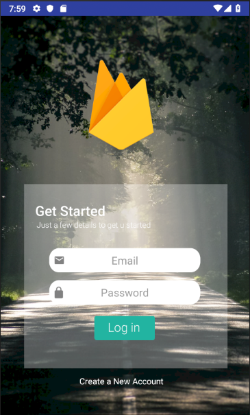
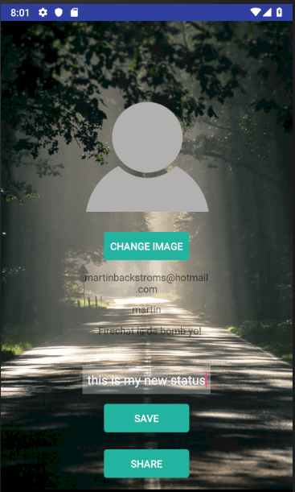
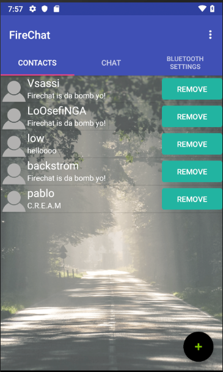
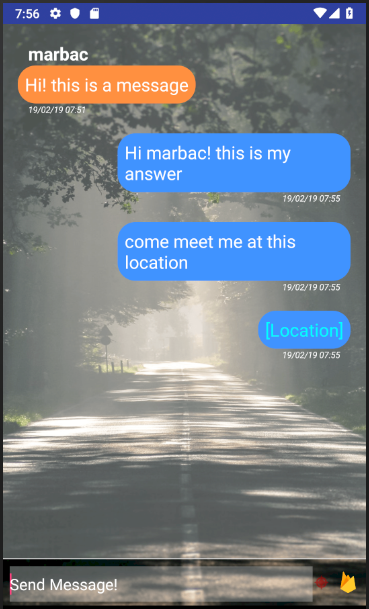

# Firechat

## Project information
```
IDE: Android Studio
Programming language: Java
```

## Description
```
A realtime chat application developed for Android smartphones on the Google Firebase platform.
The development group included four students and was developed during the course Mobile Applications at Högskolan Kristianstad. 
```

## Learning outcomes
```
Learning outcomes
*Google Firebase platform
*Realtime database
*Facebook SDK
*Google Maps
*Bluetooth communication with Android devices
*Agile workflow
```

# Login & Profile settings

# Contacts & Chat

